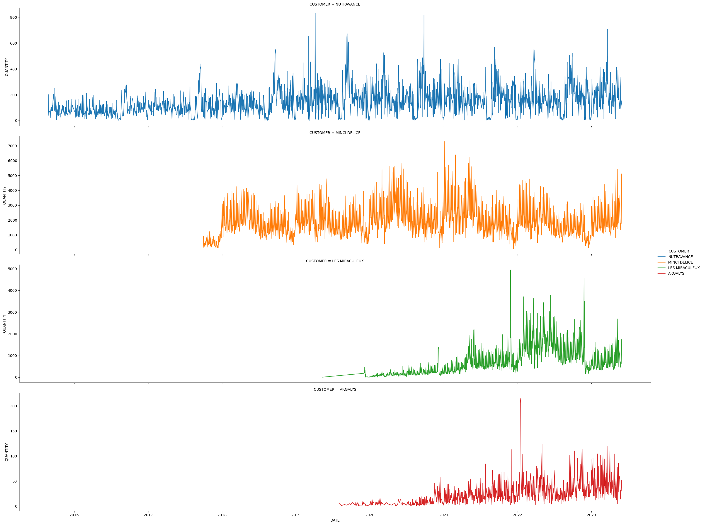
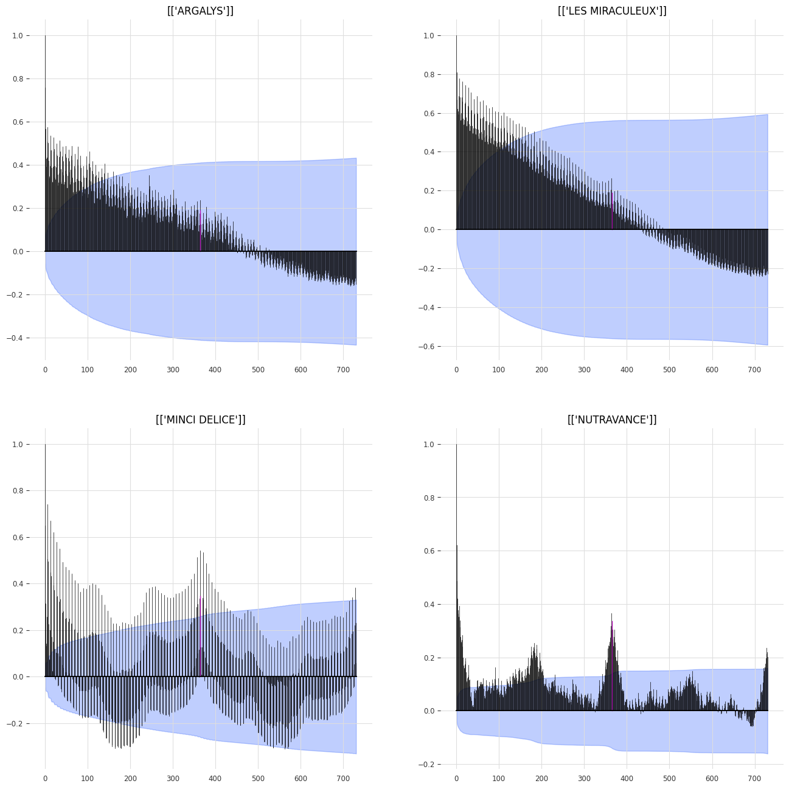
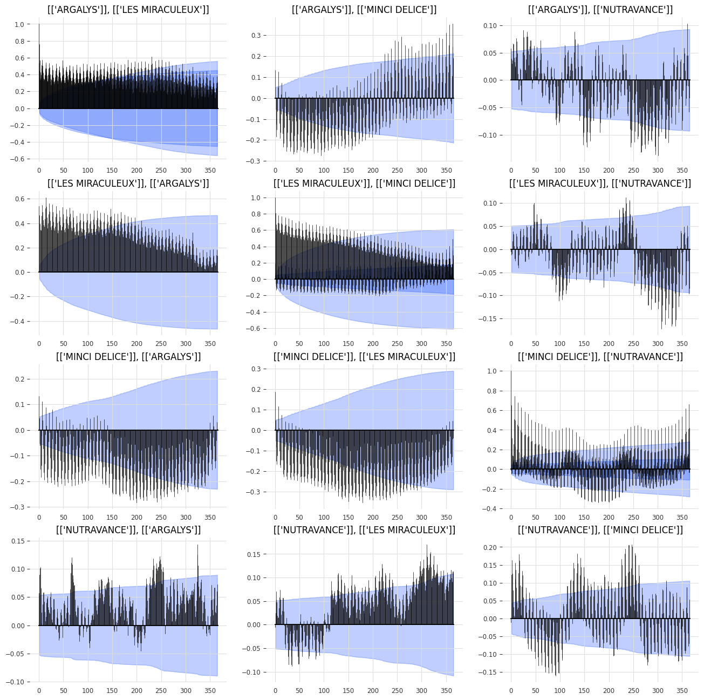
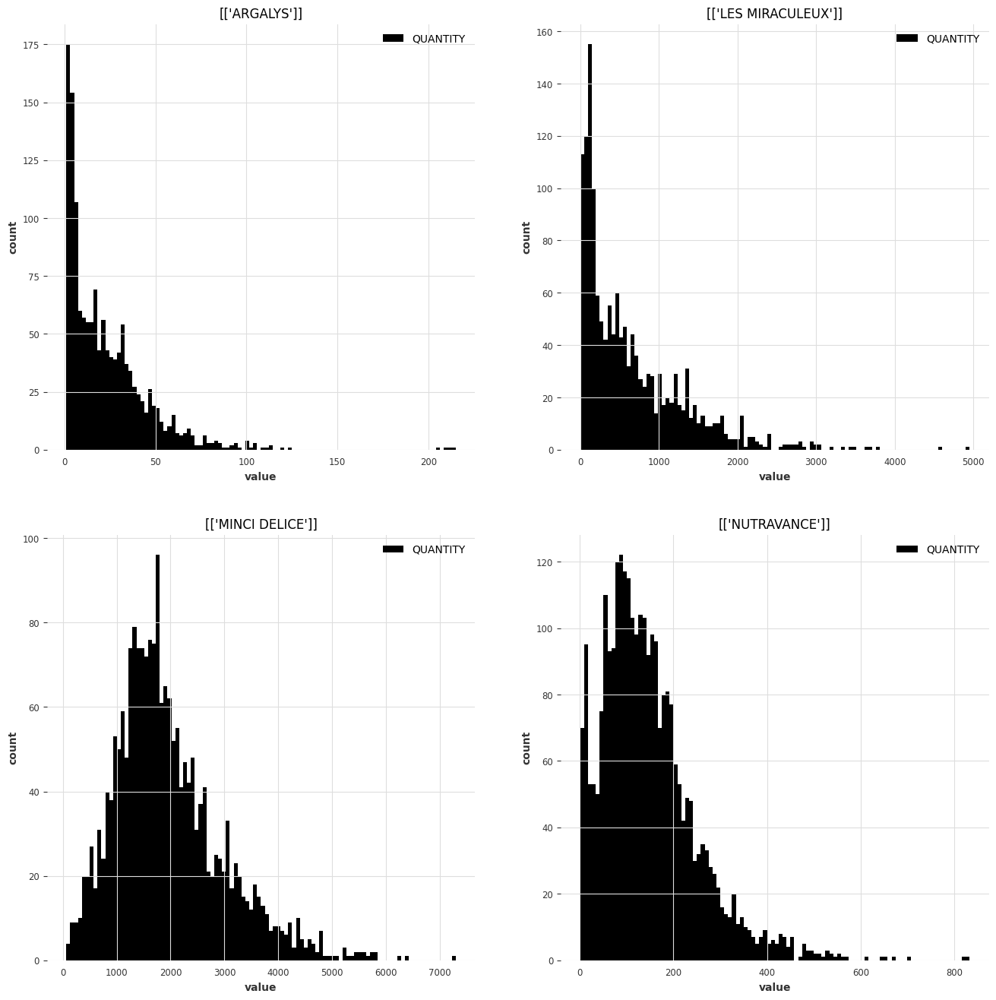
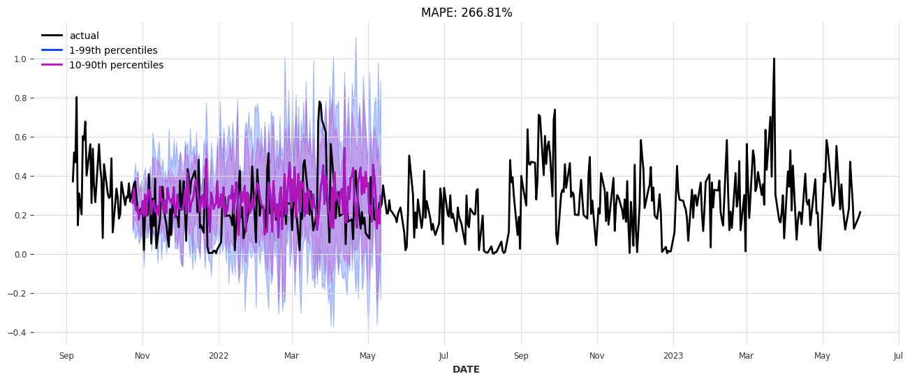
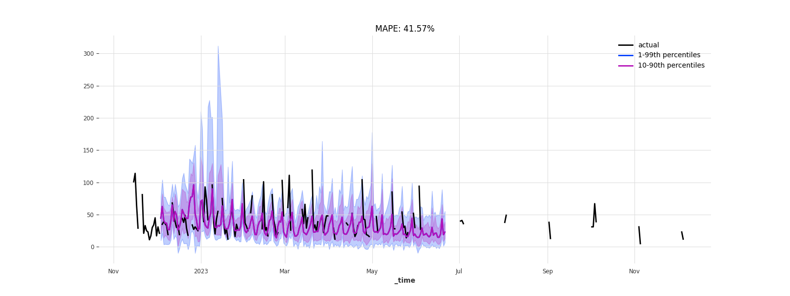
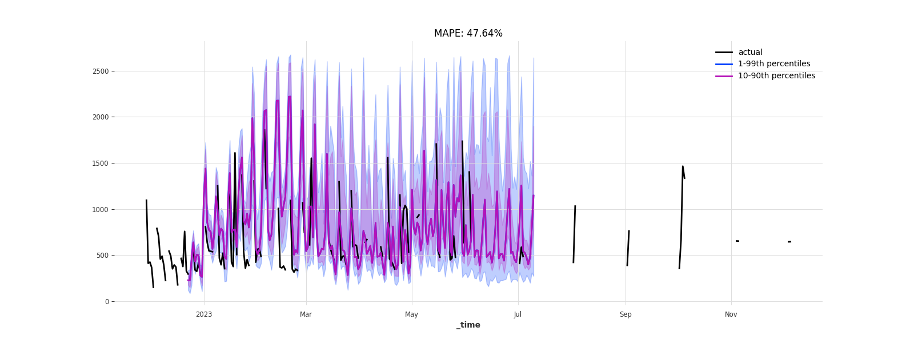
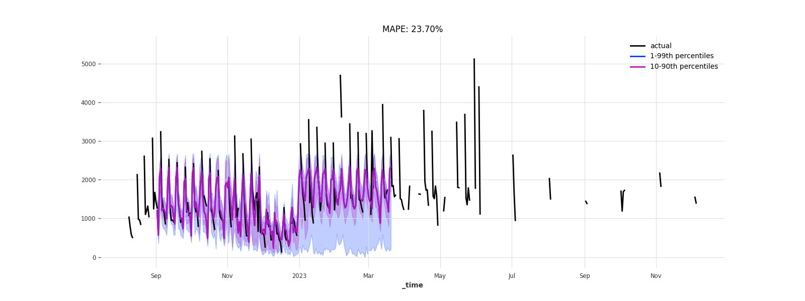

# Rapport Test Technique Antoine Audras

## Analyse préliminaire des données

Dans un premier temps j'ai procédé à une exploration des données à l'aide d'un
notebook et des librairies `pandas` et `darts`.

### Affichage des données

Une première analyse consiste à afficher les series sur le même axe temporel.

Une des première chose qui semble apparaitre à l'oeil nu est la saisonalité des series
toutes semblent exhiber des motifs qui se répètent à l'échelle des mois et des années.
On semble se rendre compte que les séries présententent des saisonalités liées.

Au moins deux d'entre elles semblent présenter des trend linéaires.

### ACF

Pour vérifier cette intuition, j'ai vérifié l'autocorrelation des séries.

La décroissance dans les séries "ARGALYS" et "LES MIRACULEUX" indique une trend, avec
une petite saisonalité représentée par les petites oscilations avec l'accroissement du
lag.

Les séries pour "MINCI DELICE" et "NUTRAVANCE" elles sont très clairement saisonières
avec une forte saisonalité annuelles et présentent une faible trend indiquée par la
décroissance dans les pics avec l'accroissement du lag.

La série "MINCI DELICE" pssède une proprété remarquable en l'oscillation rapide des pics
de la courbe d'ACF avec l'augmentation du lag. Je suppose que celà indique que les
valeurs sont corrélés (avec une alternance positive et négative) à une période qui
semble être de l'ordre de la semaine.

La série "NUTRAVANCE" présente de pics dans sa corrélation à l'échelle des mois.

### CCF

Une autre statistique intérésnate à étudier est la cross-correlation des séries, c'est
à dire à quel point les séries sont liées entre elles.

Dans le cas des 4 clients l'étude de la cross-correlation donne les figure suivantes :

Les pics de correlation entre montrent que les volumes traités chez chaque clients sont
probablement liés aux volumes traités dans les autres entrepôts, et il pouurait être
intéréssant de prendre ça en compte lors de l'entraienent des modèles.

### Histogramme

Une autre figure intéréssante est l'histogramme des séries, qui permet potentiellement
de détecter des anomalies ansi que la distribution des valeurs.

Les clients "LES MIRACULEUX" et "NUTRAVANCE" semblent traiter des volumes de l'odre
d'une centaine d'articles en période normale. Mais le client "LES MIRACULEUX" présente
une forte variance dans le nombre d'article traités par jours avec des pics
(hors anomalie) pouvant aller vers 2500 articles traités.

"ARGALYS" semble traiter des etits volumes d'articles de l'odre de l'unité, avec
quelques anomalies allant vers les 200. On peut supposer qu'ils traient des pièces
lourde ou volumineuse ou qu'il s'agit d'un tout petit entrepôt.

Le plus gros entrepôt est celui de "MINCI DELICE" avec des volumes traités
quotidiennement tournant autours de 1500 avec un histogramme exhibant les propriétés
d'une loi normale avec une variance ~1000.

## Etude des modèles

### ARIMA

Les modèles les plus classques pour le forecasting sur des séries temporelles
saisonnières avec trend sont les modèles de la faille ARMA/ARIMA.

Lors de mes explorations préliminaires je me suis intéréssé à ces modèles, Darts propose
plusieurs implémentations `Arima` classique ainsi que deux implémentation d'Auto-ARIMA.

Un entrainement rapide d'un modèle autu-ARIMA, donne les résulats suivants :

La MAPE est assez élevée, et les intervalles de confiances sont grands.

### Temporal Fusion Transformer

Les résultats obtenus étaient assez décevant, j'ai donc décidé de regarder l'état de
l'art en matière de forecasting et j'ai trouvé que les modèles de la famille TFT
semblaient de bon candidats. Darts propose une implémentation de ce modèle.

Ce modèle présente plusieurs attraits :
  - Les évaluations dans les SOTA montrent qu'il est généralement plus performant que
    la plupart des modèles.
  - C'est un modèle probabiliste, capable de prédire des sortie avec un intervale de
    confiance.
  - Il est capbale de s'entrainer sur plusieurs séries en même, temps, utile dans notre
    cas si on considère que les différentes séries sont liées.

Le modèle TFT entrainé donne les résultats suivants sur les 4 séries à prédire.

On se retrouve avec des MAPE en dessous de 50%, de même en backtest ou le caulcul des
MAPE donnes de valeurs du même ordre. Considérant la compléxité des données celà semble
être de pluôt bonnes valeures. Les intervales de confiances sont aussi plus resérrés que
pour le model ARIMA.

Les paramètres les plus importants sont la `hidden_size` des tokens, le nombre de
couches LSTM pour le décodage, le nombre de points entrée et en sortie, ainsi que le
nombre de têtes.

J'ai éffectué plusieurs experiences afin de trouver les meilleures paramètres
d'entrainement.

Le paramèetre qui semble influer le plus sur les résuldats est de
manière assez évidente al taille de la `hidden_size`, mais c'est aussi l'un de ce qui
influe le plus sur le temps de calcul. Un bon compromis entre temps de calcul et
précision semble être une taille de 64.

## Environnement

### Architecture du projet

J'ai choisi de créer un environnement centré sur un projet python.

On y retrouve ces dossier principaux :
 - `conf/` : les fichier de configuration YAML pour Hydra
 - `src/ ` : les principaux fichiers pythons
 - `scripts/` : les scripts standalone du projet
 - `notebooks/` : les notebooks

Ainsi qu'un point d'entré représenté per `run.py` qui permet d'interagir facilement
avec le projet python.

### Stack

Les principaux outils et librairies utilisées sont les suivantes.

 - InfluxDB OSS : un DBMS spcialisé sur la gestion des timeseries.
 - Hydra : une librairie permettant la gestion de configurations sauvegardées au format
   YAML, très pratique pour simplifier et automatiser les experiences.
 - Pandas : pour taiter les données tabulaire, utilisé pour préprocess les données
   passées à Darts
 - Darts : une librairie de traitement des timeseries avec des implémentations de
   plusieurs modèles standards de forecasting.
 - TorchLightning : utilisé par Darts sous le capot pour les entrainement, on peyt
   interagir avec le trainer par défaut pour specifier des callbcks, metrics ou autres.
 - git-precommit : un outil pour Git pour vérifier la qualité du code à l'aide de hooks
   avant de commit
 - Ruff : un linter pour python

### Ingestion et gestion des données avec InfluxDB

J'ai choisi de gérer les timeseries à l'aide d'un serveur InfluxDB OSS. C'est un outil
facilement scalable dans une infrastructure cloud, qui permet de gérer des données
provenant de différentes sources et qui marche relativement rapidement.

InfluxDB s'intègre bien avec de nombreux outils notamement Grafana pour le suivi des
modèles déployés.

La gestion du serveur se fait à l'aide d'un fichier docker compose.

On peut ensuite communiquer avec le serveur à l'aide d'un client python, ce qui évite
l'installation de logiciels spécifiques et permet de répliquer l'environnement
facilement.

### Gestion des configs avec Hydra

Hydra permet de définir puis instancier des configs pour des éxperiences. On retrouve
les fichier de config dans le dossier `conf/`.

Dans le dossier `conf/` les fichier de configs sont regroupés par thématique, avec
notament le sous-dossier `experiments/` regroupant les fichier des config des
experiences et `models/` ou sont définis les modèles utilisés.

On peut paramétrer les variables d'entrainement au moment du runtime avec les mechanisme
de surcharge de Hydra.

### Pipeline d'entrainement

Tous les paramètres définissant les modèles et les variables d'entrainement sont
stockées dans des configs hydra, puis composées et instanciées lors de l'appel à
`run.py`.

Les données sont extraites d'InfluxDB et converties en `Timeseries` Darts, puis
la boucle d'entrainement est gérée par Darts.

Les artefacts d'entrainement (hyperparamètres, checkpoints, log tensorboard, etc.. )
sont sauvegardés dans le dossier `outputs/`.

Vu que dans ce test nos modèles sont évalués avec la MAPE, on cherche à optimiser cette
métrique et on déclenche un easrly-stoppping si elle ne décroit plus assez vite.

### Ré-entrainement

Le réentrainement des modèles est géré de manière transparente par la logique gérent
l'entrainement. Il suffit de préciser un nouveau range de temps sur lequel s'entrainer.

Pour un modèle avec un état (tel qu'un modèle de deep-learning) il
suffit de charger les checkpoints en précisant le nom du modèle et le dossier de config
à Hydra.

### Evaluation des modèles

Pour évaluer un modèle checkpointé il suffit d'appeler la configuration de l'experience
qui a généré ce checkpoint en précisant le mode "eval".

La fonction d'évaluation calcule les prédictions sur un jeu de test et calcul la MAPE
sur les séries évaluées.

Cette fonction dispose aussi d'une capabilté de backtest.
